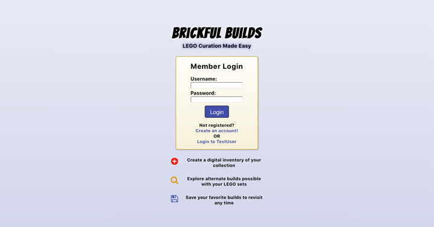
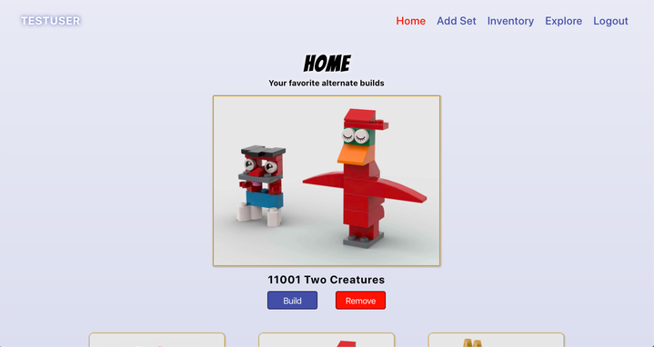

# Brickful Builds 
A LEGO curation application.

## Working Prototype

View Live App here: [Brickful Builds](https://bricksandbuilds.tsputzke.now.sh)  
View Node working prototype here: [Brickful Builds - API](https://morning-inlet-85919.herokuapp.com) 

## Summary
Brickful Builds is a LEGO curation application designed to help users organize their collection and explore other possible builds.

As a user you can create a digital inventory of your LEGO collection, explore alternate builds possible with the pieces that you already have, and save your favorite builds to revisit later.

## Designs

**Landing Page** 

**Home Page** 

## Technical

Brickful Builds was built with: 

#### Front End

* HTML5
* CSS3
* SASS
* JavaScript 
* React

#### Back End 

* Node.js 
* Express.js
* PostgreSQL

## Node command lines
* npm install ==> install all node modules
* nodemon server.js ==> run node server
* npm test ==> run the tests

## React command lines
* npm install ==> install all node modules
* npm run build ==> build the react files in the "build" folder
* npm start ==> run react server on http://127.0.0.1:8080
* npm test ==> run the tests
